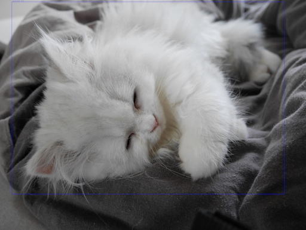

# origami-dnn

OpenCV DNN project building on [origami](https://github.com/hellonico/origami) to run Tensorflow/Caffe/Darknet networks for image/video real time analysis.

# Run origami-dnn on a file 

To run detection on a pretrained network, read the image, and call the network detection:

```
(-> input
    (imread)
    (mobilenet/find-objects net opts)
    (d/blue-boxes! labels)
    (imwrite output))
```

# Run origami-dnn on a stream from camera

```
(ns origami-dnn.demo.ssdnet.cam
  (:require [origami-dnn.net.mobilenet :refer [find-objects]]
            [origami-dnn.core :as origami-dnn]
            [origami-dnn.draw :as d]
            [opencv4.utils :refer [resize-by simple-cam-window]]))

(defn -main [& args]
  (let [ [net opts labels] (origami-dnn/read-net-from-folder "networks/caffe/mobilenet") ]
    (simple-cam-window
     (read-string (slurp "cam_config.edn"))
     (fn [buffer]
       (-> buffer 
        (find-objects net opts) 
        (d/red-boxes! labels))))))
```





| Alias           | Format     | Network | Version | DataSet  | Type | Example                                                      |
| -------------------- | ------------------------------------------------------------ | ------------------------------------------------------------ | ------------------------------------------------------------ | ------------------------------------------------------------ | ------------------------------------------------------------ | ------------------------------------------------------------ |
| mobilenet.cam           | caffe      | mobilenet |            |            |            | Run mobilenet on a webcam stream                    |
| mobilenet.videotofile   | caffe | mobilenet |    |    |    | Run mobilenet on a video file, and store it as a file  |
| mobilenet.videotoscreen | caffe | mobilenet |  |  |  | Run mobilenet on a video file, and display the file in a window |
| mobilenet.one           | caffe      | mobilenet  |            |            |            | Run mobilenet on one image and save the picture as a file |
| yolo.cam             | darknet     | Yolo         |              |              |              | Run yolo on a webcam stream                                  |
| yolo.one             | darknet      | Yolo         |              |              |              | Run yolo (tiny) on a picture                                 |
| yolo.v2              | darknet       | Yolo          | v2          |               |               | Run yolo v2 on a picture                                     |
| yolo.v2tiny          | darknet   | Yolo      | v2.tiny |           |           | Run yolo v2 tiny on a picture                                |
| yolo.v3              | darknet       | Yolo          | v3           |               |               | Run yolo v3 on a picture                                     |
| yolo.v3tiny          | darknet   | Yolo      | v3.tiny   |           |           | Run yolo v3 tiny on a picture                                |
| yolo.videotoscreen   | darknet | Yolo |    |    |    | Run yolo on a video file, and display the file in a window   |
| yolo.videotofile     | darknet | Yolo |      |      |      | Run yolo don a video file, and save the picture as a file    |
| convnet.gender   | caffe | ConvNet |    |    | classification | Run convnet on a picture, determine male or female |
| convnet.age | caffe | ConvNet |  |  | classification | Run cnet on a picture, determine age                      |
| marcel | caffe | MobileNet |  |  | detection | Run detection using mobilet on video and display |
| marcel2 | caffe | MobileNet |  |  | detection | Run detection using mobilenet on video and save to file |
| bvlc | caffe | AlexNet |  |  | classification | Run object classification using bvlc |
| places365 | caffe |  |  |  | classification | Run object classification using places365 |
| resnet | caffe | ResNet |  |  | classification | Run object classfication using Resnet |
| cifar | darknet |  |  |  | classification | Classification using a custom Trained Darknet Model based on cifar |
| enet | darknet | Enet |  |  |  | Run detection with enet |
| openimages | darknet |  |  |  |  | Run detection with Yolo v3 Trained on OpenImages |
| flowers | caffe |  |  |  |  | Flower detection based on trained oxford102 |
| tensorflow.mobilenet | tensorflow | MobileNet | V1 | Coco | Detection | On an image |

# Marcel le chat

This is a sample output generated on a macbook.

```
lein run -m  origami-dnn.demo.mobilenet.catvideotofile resources/vids/Marcel.m4v
# or 
lein run -m  origami-dnn.demo.marcel.marcel
```


or another one ...


Video courtesy of Marcel le chat.

# Using the clj command

```
clj -Mcifar
```

where the alias cifar is one according to the table below:


| Alias           |
| -------------------- |
| :fscam |
| :mobilenet.cam |
| :mobilenet.videotofile |
| :mobilenet.videotoscreen |
| :mobilenet.one |
| :yolo.cam |
| :yolo.one |
| :yolo.v2 |
| :yolo.v2tiny |
| :yolo.v3 |
| :yolo.v3tiny |
| :yolo.videotoscreen |
| "yolo.videotofile" |
| :enet |
| :openimages |
| :convnet.age |
| :convnet.age.cam |
| :convnet.gender |
| :bvlc |
| :googlenet |
| :places365 |
| :resnet |
| :marcel |
| :marcel.rotated |
| :tensorflow.mobilenet |
| :cifar |
| :flowers |

or create a deps.edn with the following content:

```
{:mvn/repos
   {"vendredi" {:url "https://repository.hellonico.info/repository/hellonico/"}}
 :deps
   { origami-dnn {:mvn/version "0.1.13"}}}
```

and run one of the namespaces like shown below:
```
clj -m origami-dnn.demo.agecam
#  or
clj -m origami-dnn.demo.yolo.cam
```
or start a repl and do the same:
```
# clj 
(require '[origami-dnn.demo.agecam :as agecam])
(agecam/-main)
```